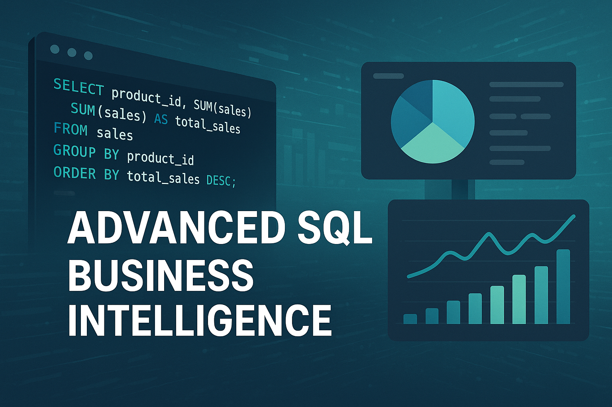

# 🇧🇷 Business Intelligence com SQL Avançado | 🇺🇸 Advanced SQL Business Intelligence

<div align="center">


**Plataforma completa de Business Intelligence com SQL avançado, dashboards interativos e análises empresariais**

[📊 Dashboards](#-dashboards-implementados) • [📈 KPIs](#-kpis-e-métricas) • [⚡ Setup](#-setup-rápido) • [🎯 Casos de Uso](#-casos-de-uso)

</div>

---


### 🖼️ Imagem Hero

<div align="center">
  
</div>

### 📋 Estrutura da Plataforma

```mermaid
graph TD
    A[sql-business-intelligence/] --> B[📁 sql/]
    A --> C[📁 dashboards/]
    A --> D[📁 python/]
    A --> E[📁 data_models/]
    A --> F[📁 reports/]
    A --> G[📁 notebooks/]
    A --> H[📁 configs/]
    A --> I[📁 docker/]
    A --> J[📁 tests/]
    A --> K[📄 requirements.txt]
    A --> L[📄 README.md]
    A --> M[📄 LICENSE]
    A --> N[📄 .gitignore]

    B --> B1[📁 kpis/]
    B --> B2[📁 analytics/]
    B --> B3[📁 forecasting/]
    B --> B4[📁 executive/]
    B --> B5[📁 operational/]
    B --> B6[📁 adhoc/]

    C --> C1[📁 superset/]
    C --> C2[📁 powerbi/]
    C --> C3[📁 tableau/]
    C --> C4[📁 grafana/]

    D --> D1[📁 etl/]
    D --> D2[📁 analytics/]
    D --> D3[📁 automation/]
    D --> D4[📁 api/]
    D --> D5[📁 utils/]

    E --> E1[📁 dimensional/]
    E --> E2[📁 aggregated/]
    E --> E3[📁 views/]

    F --> F1[📁 executive/]
    F --> F2[📁 operational/]
    F --> F3[📁 analytical/]

    G --> G1[📄 01_data_exploration.ipynb]
    G --> G2[📄 02_kpi_development.ipynb]
    G --> G3[📄 03_dashboard_prototyping.ipynb]
    G --> G4[📄 04_advanced_analytics.ipynb]
    G --> G5[📄 05_predictive_modeling.ipynb]

    H --> H1[📄 database_config.yaml]
    H --> H2[📄 dashboard_config.yaml]
    H --> H3[📄 kpi_definitions.yaml]
    H --> H4[📄 alert_config.yaml]

    I --> I1[📄 Dockerfile.superset]
    I --> I2[📄 Dockerfile.api]
    I --> I3[📄 docker-compose.yml]

    J --> J1[📄 test_sql_queries.py]
    J --> J2[📄 test_kpis.py]
    J --> J3[📄 test_api.py]
```




## 🇧🇷 Português

### 📊 Visão Geral

Plataforma abrangente de **Business Intelligence** desenvolvida com SQL avançado e ferramentas modernas de visualização:

- 📈 **Dashboards Executivos**: KPIs estratégicos e métricas de negócio
- 🔍 **Análises Avançadas**: Cohort, RFM, forecasting, análise de tendências
- 📊 **Visualizações Interativas**: Power BI, Tableau, Apache Superset
- 🎯 **Self-Service BI**: Ferramentas para usuários não-técnicos
- 📋 **Relatórios Automatizados**: Geração automática de relatórios
- 🔄 **ETL Inteligente**: Pipelines de dados otimizados

### 🎯 Objetivos da Plataforma

- **Democratizar acesso** a dados e insights
- **Acelerar tomada de decisão** com dados em tempo real
- **Padronizar métricas** e definições de negócio
- **Automatizar relatórios** operacionais e estratégicos
- **Facilitar análises** self-service para usuários

### 🛠️ Stack Tecnológico

#### Database e Analytics
| Ferramenta | Descrição |
| :--------- | :-------- |
| **PostgreSQL** | Database principal para analytics |
| **ClickHouse** | Database colunar para OLAP |
| **Amazon Redshift** | Data warehouse na nuvem |
| **Apache Drill** | Query engine para múltiplas fontes |

#### Visualização e BI
| Ferramenta | Descrição |
| :--------- | :-------- |
| **Apache Superset** | Plataforma BI open-source |
| **Power BI** | Dashboards corporativos Microsoft |
| **Tableau** | Visualizações avançadas |
| **Grafana** | Monitoramento e métricas operacionais |

#### Processamento e ETL
| Ferramenta | Descrição |
| :--------- | :-------- |
| **Apache Airflow** | Orquestração de workflows |
| **dbt** | Transformações SQL como código |
| **Pandas** | Processamento de dados em Python |
| **Apache Spark** | Processamento distribuído |

#### APIs e Integração
| Ferramenta | Descrição |
| :--------- | :-------- |
| **FastAPI** | APIs para dados e métricas |
| **SQLAlchemy** | ORM para Python |
| **Celery** | Processamento assíncrono |
| **Redis** | Cache e message broker |

### 📊 Dashboards Implementados

#### 1. 📈 Dashboard Executivo

**KPIs Estratégicos**
```sql
-- Dashboard Executivo - KPIs Principais
WITH financial_metrics AS (
    SELECT 
        DATE_TRUNC('month', order_date) AS month,
        SUM(total_amount) AS revenue,
        SUM(total_amount - cost_amount) AS gross_profit,
        COUNT(DISTINCT order_id) AS total_orders,
        COUNT(DISTINCT customer_id) AS active_customers,
        AVG(total_amount) AS avg_order_value
    FROM fact_sales fs
    JOIN dim_date dd ON fs.date_key = dd.date_key
    WHERE order_date >= CURRENT_DATE - INTERVAL '24 months'
    GROUP BY DATE_TRUNC('month', order_date)
),
growth_metrics AS (
    SELECT 
        month,
        revenue,
        gross_profit,
        total_orders,
        active_customers,
        avg_order_value,
        -- Crescimento mês a mês
        LAG(revenue) OVER (ORDER BY month) AS prev_month_revenue,
        LAG(gross_profit) OVER (ORDER BY month) AS prev_month_profit,
        LAG(active_customers) OVER (ORDER BY month) AS prev_month_customers,
        -- Crescimento ano a ano
        LAG(revenue, 12) OVER (ORDER BY month) AS prev_year_revenue,
        LAG(gross_profit, 12) OVER (ORDER BY month) AS prev_year_profit
    FROM financial_metrics
),
kpi_dashboard AS (
    SELECT 
        month,
        revenue,
        gross_profit,
        ROUND(100.0 * gross_profit / revenue, 2) AS gross_margin_pct,
        total_orders,
        active_customers,
        ROUND(avg_order_value, 2) AS avg_order_value,
        
        -- Crescimento MoM
        CASE 
            WHEN prev_month_revenue > 0 THEN
                ROUND(100.0 * (revenue - prev_month_revenue) / prev_month_revenue, 2)
            ELSE NULL
        END AS revenue_growth_mom,
        
        CASE 
            WHEN prev_month_customers > 0 THEN
                ROUND(100.0 * (active_customers - prev_month_customers) / prev_month_customers, 2)
            ELSE NULL
        END AS customer_growth_mom,
        
        -- Crescimento YoY
        CASE 
            WHEN prev_year_revenue > 0 THEN
                ROUND(100.0 * (revenue - prev_year_revenue) / prev_year_revenue, 2)
            ELSE NULL
        END AS revenue_growth_yoy,
        
        -- Métricas acumuladas
        SUM(revenue) OVER (ORDER BY month ROWS UNBOUNDED PRECEDING) AS cumulative_revenue,
        SUM(gross_profit) OVER (ORDER BY month ROWS UNBOUNDED PRECEDING) AS cumulative_profit
    FROM growth_metrics
)
SELECT 
    month,
    revenue,
    gross_profit,
    gross_margin_pct,
    total_orders,
    active_customers,
    avg_order_value,
    revenue_growth_mom,
    customer_growth_mom,
    revenue_growth_yoy,
    cumulative_revenue,
    cumulative_profit,
    
    -- Indicadores de performance
    CASE 
        WHEN revenue_growth_mom >= 10 THEN '🟢 Excelente'
        WHEN revenue_growth_mom >= 5 THEN '🟡 Bom'
        WHEN revenue_growth_mom >= 0 THEN '🟠 Moderado'
        ELSE '🔴 Atenção'
    END AS revenue_performance,
    
    CASE 
        WHEN gross_margin_pct >= 40 THEN '🟢 Saudável'
        WHEN gross_margin_pct >= 25 THEN '🟡 Aceitável'
        ELSE '🔴 Baixa'
    END AS margin_health
FROM kpi_dashboard
ORDER BY month DESC;
```

**Scorecard Executivo**
```sql
-- Scorecard Executivo - Métricas Atuais vs Metas
WITH current_month_metrics AS (
    SELECT 
        SUM(total_amount) AS current_revenue,
        SUM(total_amount - cost_amount) AS current_profit,
        COUNT(DISTINCT order_id) AS current_orders,
        COUNT(DISTINCT customer_id) AS current_customers,
        AVG(total_amount) AS current_aov
    FROM fact_sales fs
    JOIN dim_date dd ON fs.date_key = dd.date_key
    WHERE DATE_TRUNC('month', order_date) = DATE_TRUNC('month', CURRENT_DATE)
),
targets AS (
    SELECT 
        5000000 AS revenue_target,    -- Meta de receita mensal
        2000000 AS profit_target,     -- Meta de lucro mensal
        10000 AS orders_target,       -- Meta de pedidos mensais
        3000 AS customers_target,     -- Meta de clientes ativos
        500 AS aov_target            -- Meta de ticket médio
),
scorecard AS (
    SELECT 
        -- Métricas atuais
        current_revenue,
        current_profit,
        current_orders,
        current_customers,
        current_aov,
        
        -- Metas
        revenue_target,
        profit_target,
        orders_target,
        customers_target,
        aov_target,
        
        -- Performance vs Meta
        ROUND(100.0 * current_revenue / revenue_target, 1) AS revenue_vs_target_pct,
        ROUND(100.0 * current_profit / profit_target, 1) AS profit_vs_target_pct,
        ROUND(100.0 * current_orders / orders_target, 1) AS orders_vs_target_pct,
        ROUND(100.0 * current_customers / customers_target, 1) AS customers_vs_target_pct,
        ROUND(100.0 * current_aov / aov_target, 1) AS aov_vs_target_pct
    FROM current_month_metrics, targets
)
SELECT 
    *,
    -- Status indicators
    CASE 
        WHEN revenue_vs_target_pct >= 100 THEN '✅ Meta Atingida'
        WHEN revenue_vs_target_pct >= 90 THEN '🟡 Próximo da Meta'
        WHEN revenue_vs_target_pct >= 75 THEN '🟠 Abaixo da Meta'
        ELSE '🔴 Muito Abaixo'
    END AS revenue_status,
    
    CASE 
        WHEN profit_vs_target_pct >= 100 THEN '✅ Meta Atingida'
        WHEN profit_vs_target_pct >= 90 THEN '🟡 Próximo da Meta'
        WHEN profit_vs_target_pct >= 75 THEN '🟠 Abaixo da Meta'
        ELSE '🔴 Muito Abaixo'
    END AS profit_status
FROM scorecard;
```

#### 2. 🛍️ Dashboard de Vendas

**Análise de Performance de Vendas**
```sql
-- Dashboard de Vendas - Análise Detalhada
WITH sales_performance AS (
    SELECT 
        dp.category,
        dp.subcategory,
        dp.product_name,
        SUM(fs.quantity) AS units_sold,
        SUM(fs.total_amount) AS total_revenue,
        SUM(fs.total_amount - fs.cost_amount) AS total_profit,
        COUNT(DISTINCT fs.order_id) AS orders_count,
        COUNT(DISTINCT fs.customer_id) AS unique_customers,
        AVG(fs.unit_price) AS avg_selling_price,
        
        -- Métricas de performance
        ROUND(100.0 * SUM(fs.total_amount - fs.cost_amount) / SUM(fs.total_amount), 2) AS profit_margin_pct,
        ROUND(SUM(fs.total_amount) / COUNT(DISTINCT fs.order_id), 2) AS revenue_per_order,
        ROUND(SUM(fs.quantity) / COUNT(DISTINCT fs.order_id), 2) AS units_per_order
    FROM fact_sales fs
    JOIN dim_product dp ON fs.product_key = dp.product_key
    WHERE fs.order_date >= CURRENT_DATE - INTERVAL '12 months'
    GROUP BY dp.category, dp.subcategory, dp.product_name
),
sales_ranking AS (
    SELECT 
        *,
        RANK() OVER (ORDER BY total_revenue DESC) AS revenue_rank,
        RANK() OVER (ORDER BY total_profit DESC) AS profit_rank,
        RANK() OVER (ORDER BY units_sold DESC) AS units_rank
    FROM sales_performance
)
SELECT 
    category,
    subcategory,
    product_name,
    units_sold,
    total_revenue,
    total_profit,
    profit_margin_pct,
    revenue_per_order,
    units_per_order,
    revenue_rank,
    profit_rank,
    units_rank,
    
    -- Indicadores de performance
    CASE 
        WHEN revenue_rank <= 10 THEN 'Top 10 Receita'
        WHEN profit_rank <= 10 THEN 'Top 10 Lucro'
        ELSE 'Outros'
    END AS product_performance_segment
FROM sales_ranking
ORDER BY revenue_rank;
```

#### 3. 👥 Dashboard de Clientes

**Análise 360° do Cliente e Segmentação RFM**
```sql
-- Dashboard de Clientes - Análise 360° e RFM
WITH customer_data AS (
    SELECT 
        dc.customer_id,
        dc.customer_name,
        dc.email,
        dc.region,
        MAX(fs.order_date) AS last_purchase_date,
        MIN(fs.order_date) AS first_purchase_date,
        COUNT(DISTINCT fs.order_id) AS total_orders,
        SUM(fs.total_amount) AS total_spent,
        AVG(fs.total_amount) AS avg_order_value
    FROM dim_customer dc
    JOIN fact_sales fs ON dc.customer_key = fs.customer_key
    GROUP BY dc.customer_id, dc.customer_name, dc.email, dc.region
),
rfm_metrics AS (
    SELECT 
        customer_id,
        customer_name,
        email,
        region,
        last_purchase_date,
        first_purchase_date,
        total_orders,
        total_spent,
        avg_order_value,
        
        -- Recência (Days Since Last Purchase)
        EXTRACT(DAY FROM (CURRENT_DATE - last_purchase_date)) AS recency,
        
        -- Frequência (Total Orders)
        total_orders AS frequency,
        
        -- Valor Monetário (Total Spent)
        total_spent AS monetary
    FROM customer_data
),
rfm_scores AS (
    SELECT 
        customer_id,
        customer_name,
        email,
        region,
        recency,
        frequency,
        monetary,
        
        NTILE(5) OVER (ORDER BY recency DESC) AS r_score, -- Menor recência = maior score
        NTILE(5) OVER (ORDER BY frequency ASC) AS f_score, -- Maior frequência = maior score
        NTILE(5) OVER (ORDER BY monetary ASC) AS m_score  -- Maior valor monetário = maior score
    FROM rfm_metrics
),
rfm_segmentation AS (
    SELECT 
        customer_id,
        customer_name,
        email,
        region,
        recency,
        frequency,
        monetary,
        r_score,
        f_score,
        m_score,
        
        CASE
            WHEN r_score >= 4 AND f_score >= 4 AND m_score >= 4 THEN 'Champions'
            WHEN r_score >= 2 AND f_score >= 3 AND m_score >= 3 THEN 'Loyal Customers'
            WHEN r_score >= 4 AND f_score <= 2 AND m_score <= 2 THEN 'New Customers'
            WHEN r_score <= 2 AND f_score >= 3 AND m_score >= 3 THEN 'At Risk'
            WHEN r_score <= 1 AND f_score <= 1 AND m_score <= 1 THEN 'Lost Customers'
            ELSE 'Other'
        END AS rfm_segment
    FROM rfm_scores
)
SELECT 
    customer_id,
    customer_name,
    email,
    region,
    recency,
    frequency,
    monetary,
    rfm_segment,
    
    -- Insights adicionais
    CASE 
        WHEN rfm_segment = 'Champions' THEN 'Clientes mais valiosos, engajar com programas VIP'
        WHEN rfm_segment = 'Loyal Customers' THEN 'Manter engajamento, oferecer recompensas'
        WHEN rfm_segment = 'New Customers' THEN 'Focar em onboarding e primeira compra'
        WHEN rfm_segment = 'At Risk' THEN 'Campanhas de reengajamento, ofertas especiais'
        WHEN rfm_segment = 'Lost Customers' THEN 'Tentar reativar com ofertas agressivas ou ignorar'
        ELSE 'Análise individual necessária'
    END AS recommended_action
FROM rfm_segmentation
ORDER BY r_score DESC, f_score DESC, m_score DESC;
```

### 📈 KPIs e Métricas

#### 1. 💰 KPIs Financeiros

**Métricas de Receita e Rentabilidade**
```sql
-- KPIs Financeiros Principais
WITH financial_kpis AS (
    SELECT 
        -- Período de análise
        DATE_TRUNC('month', dd.date_actual) AS month,
        
        -- Receitas
        SUM(fs.total_amount) AS gross_revenue,
        SUM(fs.total_amount - fs.discount_amount) AS net_revenue,
        SUM(fs.total_amount - fs.cost_amount) AS gross_profit,
        SUM(fs.total_amount - fs.cost_amount - fs.operating_expenses) AS operating_profit,
        
        -- Custos
        SUM(fs.cost_amount) AS total_costs,
        SUM(fs.operating_expenses) AS operating_expenses,
        SUM(fs.discount_amount) AS total_discounts,
        
        -- Volumes
        COUNT(DISTINCT fs.order_id) AS total_transactions,
        SUM(fs.quantity) AS total_units_sold,
        COUNT(DISTINCT fs.customer_id) AS active_customers
    FROM fact_sales fs
    JOIN dim_date dd ON fs.date_key = dd.date_key
    WHERE dd.date_actual >= CURRENT_DATE - INTERVAL '24 months'
    GROUP BY DATE_TRUNC('month', dd.date_actual)
),
calculated_kpis AS (
    SELECT 
        month,
        gross_revenue,
        net_revenue,
        gross_profit,
        operating_profit,
        
        -- Margens
        ROUND(100.0 * gross_profit / gross_revenue, 2) AS gross_margin_pct,
        ROUND(100.0 * operating_profit / gross_revenue, 2) AS operating_margin_pct,
        ROUND(100.0 * total_discounts / gross_revenue, 2) AS discount_rate_pct,
        
        -- Métricas por transação
        ROUND(gross_revenue / total_transactions, 2) AS avg_transaction_value,
        ROUND(gross_profit / total_transactions, 2) AS avg_profit_per_transaction,
        
        -- Métricas por cliente
        ROUND(gross_revenue / active_customers, 2) AS revenue_per_customer,
        ROUND(total_transactions::DECIMAL / active_customers, 2) AS transactions_per_customer,
        
        -- Eficiência operacional
        ROUND(operating_expenses / gross_revenue * 100, 2) AS opex_ratio_pct,
        ROUND(total_costs / total_units_sold, 2) AS cost_per_unit
    FROM financial_kpis
)
SELECT 
    month,
    gross_revenue,
    net_revenue,
    gross_profit,
    operating_profit,
    gross_margin_pct,
    operating_margin_pct,
    discount_rate_pct,
    avg_transaction_value,
    revenue_per_customer,
    
    -- Crescimento mês a mês
    LAG(gross_revenue) OVER (ORDER BY month) AS prev_month_revenue,
    ROUND(100.0 * (gross_revenue - LAG(gross_revenue) OVER (ORDER BY month)) / 
          LAG(gross_revenue) OVER (ORDER BY month), 2) AS revenue_growth_mom,
    
    -- Crescimento ano a ano
    LAG(gross_revenue, 12) OVER (ORDER BY month) AS prev_year_revenue,
    ROUND(100.0 * (gross_revenue - LAG(gross_revenue, 12) OVER (ORDER BY month)) / 
          LAG(gross_revenue, 12) OVER (ORDER BY month), 2) AS revenue_growth_yoy,
    
    -- Indicadores de saúde financeira
    CASE 
        WHEN gross_margin_pct >= 40 THEN 'Excelente'
        WHEN gross_margin_pct >= 25 THEN 'Boa'
        WHEN gross_margin_pct >= 15 THEN 'Aceitável'
        ELSE 'Preocupante'
    END AS margin_health,
    
    CASE 
        WHEN operating_margin_pct >= 15 THEN 'Muito Rentável'
        WHEN operating_margin_pct >= 10 THEN 'Rentável'
        WHEN operating_margin_pct >= 5 THEN 'Moderadamente Rentável'
        ELSE 'Baixa Rentabilidade'
    END AS profitability_status
FROM calculated_kpis
ORDER BY month DESC;
```

#### 2. 📊 KPIs Operacionais

**Métricas de Eficiência Operacional**
```sql
-- KPIs Operacionais
WITH operational_metrics AS (
    SELECT 
        DATE_TRUNC('week', dd.date_actual) AS week,
        
        -- Métricas de pedidos
        COUNT(DISTINCT fs.order_id) AS total_orders,
        COUNT(DISTINCT CASE WHEN fs.order_status = 'completed' THEN fs.order_id END) AS completed_orders,
        COUNT(DISTINCT CASE WHEN fs.order_status = 'cancelled' THEN fs.order_id END) AS cancelled_orders,
        COUNT(DISTINCT CASE WHEN fs.order_status = 'returned' THEN fs.order_id END) AS returned_orders,
        
        -- Métricas de tempo
        AVG(fs.processing_time_hours) AS avg_processing_time,
        AVG(fs.shipping_time_hours) AS avg_shipping_time,
        AVG(fs.delivery_time_hours) AS avg_delivery_time,
        
        -- Métricas de qualidade
        COUNT(DISTINCT CASE WHEN fs.customer_rating >= 4 THEN fs.order_id END) AS high_rated_orders,
        AVG(fs.customer_rating) AS avg_customer_rating,
        
        -- Métricas de estoque
        AVG(dp.stock_level) AS avg_stock_level,
        COUNT(DISTINCT CASE WHEN dp.stock_level = 0 THEN dp.product_id END) AS out_of_stock_products
    FROM fact_sales fs
    JOIN dim_date dd ON fs.date_key = dd.date_key
    JOIN dim_product dp ON fs.product_key = dp.product_key
    WHERE dd.date_actual >= CURRENT_DATE - INTERVAL '12 weeks'
    GROUP BY DATE_TRUNC('week', dd.date_actual)
),
operational_kpis AS (
    SELECT 
        week,
        total_orders,
        completed_orders,
        cancelled_orders,
        returned_orders,
        
        -- Taxas de conversão e qualidade
        ROUND(100.0 * completed_orders / total_orders, 2) AS completion_rate_pct,
        ROUND(100.0 * cancelled_orders / total_orders, 2) AS cancellation_rate_pct,
        ROUND(100.0 * returned_orders / completed_orders, 2) AS return_rate_pct,
        ROUND(100.0 * high_rated_orders / completed_orders, 2) AS satisfaction_rate_pct,
        
        -- Métricas de tempo (SLA)
        ROUND(avg_processing_time, 1) AS avg_processing_hours,
        ROUND(avg_shipping_time, 1) AS avg_shipping_hours,
        ROUND(avg_delivery_time, 1) AS avg_delivery_hours,
        ROUND(avg_processing_time + avg_shipping_time + avg_delivery_time, 1) AS total_fulfillment_time,
        
        -- Métricas de qualidade
        ROUND(avg_customer_rating, 2) AS avg_rating,
        out_of_stock_products,
        
        -- Indicadores de performance
        CASE 
            WHEN avg_processing_time <= 24 THEN 'Excelente'
            WHEN avg_processing_time <= 48 THEN 'Bom'
            WHEN avg_processing_time <= 72 THEN 'Aceitável'
            ELSE 'Lento'
        END AS processing_performance,
        
        CASE 
            WHEN completion_rate_pct >= 95 THEN 'Excelente'
            WHEN completion_rate_pct >= 90 THEN 'Bom'
            WHEN completion_rate_pct >= 85 THEN 'Aceitável'
            ELSE 'Problemático'
        END AS completion_performance
    FROM operational_metrics
)
SELECT 
    week,
    total_orders,
    completion_rate_pct,
    cancellation_rate_pct,
    return_rate_pct,
    satisfaction_rate_pct,
    avg_processing_hours,
    avg_shipping_hours,
    avg_delivery_hours,
    total_fulfillment_time,
    avg_rating,
    out_of_stock_products,
    processing_performance,
    completion_performance,
    
    -- Tendências semanais
    LAG(completion_rate_pct) OVER (ORDER BY week) AS prev_week_completion,
    completion_rate_pct - LAG(completion_rate_pct) OVER (ORDER BY week) AS completion_trend,
    
    LAG(avg_rating) OVER (ORDER BY week) AS prev_week_rating,
    ROUND(avg_rating - LAG(avg_rating) OVER (ORDER BY week), 2) AS rating_trend
FROM operational_kpis
ORDER BY week DESC;
```

### 🎯 Casos de Uso Práticos

#### 1. Análise de Vendas e Marketing

- **Segmentação de Clientes**: Utilize a segmentação RFM para identificar clientes de alto valor, clientes em risco e clientes perdidos. Direcione campanhas de marketing personalizadas para cada segmento.
- **Otimização de Campanhas**: Analise a performance de vendas por canal, produto e região para otimizar o investimento em marketing e identificar oportunidades de crescimento.
- **Previsão de Demanda**: Use modelos de forecasting baseados em dados históricos para prever a demanda futura e otimizar a gestão de estoque e produção.

#### 2. Gestão Financeira e Operacional

- **Monitoramento de KPIs Financeiros**: Acompanhe de perto a receita, lucro, margens e custos para garantir a saúde financeira da empresa. Identifique desvios e tome ações corretivas rapidamente.
- **Otimização de Processos**: Analise os KPIs operacionais, como tempo de processamento de pedidos e taxa de conclusão, para identificar gargalos e otimizar a eficiência dos processos.
- **Gestão de Estoque**: Utilize dados de vendas e previsão de demanda para otimizar os níveis de estoque, reduzindo custos de armazenagem e evitando rupturas.

#### 3. Desenvolvimento de Produtos e Serviços

- **Análise de Performance de Produtos**: Identifique os produtos mais vendidos, os mais lucrativos e aqueles com baixa performance. Utilize esses insights para guiar o desenvolvimento de novos produtos e aprimorar os existentes.
- **Feedback de Clientes**: Analise o rating médio dos clientes e os comentários para entender a satisfação com produtos e serviços, e identificar áreas de melhoria.
- **Inovação Baseada em Dados**: Explore novas oportunidades de mercado e tendências de consumo através da análise de dados, impulsionando a inovação e a competitividade.

---


 

---

## 🇺🇸 English

### 📊 Overview

A comprehensive **Business Intelligence** platform developed with advanced SQL and modern visualization tools:

- 📈 **Executive Dashboards**: Strategic KPIs and business metrics
- 🔍 **Advanced Analytics**: Cohort, RFM, forecasting, trend analysis
- 📊 **Interactive Visualizations**: Power BI, Tableau, Apache Superset
- 🎯 **Self-Service BI**: Tools for non-technical users
- 📋 **Automated Reports**: Automatic report generation
- 🔄 **Intelligent ETL**: Optimized data pipelines

### 🎯 Platform Objectives

- **Democratize access** to data and insights
- **Accelerate decision-making** with real-time data
- **Standardize metrics** and business definitions
- **Automate operational and strategic reports**
- **Facilitate self-service analysis** for users

### 🛠️ Tech Stack

#### Database and Analytics
| Tool | Description |
| :--- | :--- |
| **PostgreSQL** | Main database for analytics |
| **ClickHouse** | Columnar database for OLAP |
| **Amazon Redshift** | Cloud data warehouse |
| **Apache Drill** | Query engine for multiple sources |

#### Visualization and BI
| Tool | Description |
| :--- | :--- |
| **Apache Superset** | Open-source BI platform |
| **Power BI** | Microsoft corporate dashboards |
| **Tableau** | Advanced visualizations |
| **Grafana** | Monitoring and operational metrics |

#### Processing and ETL
| Tool | Description |
| :--- | :--- |
| **Apache Airflow** | Workflow orchestration |
| **dbt** | SQL transformations as code |
| **Pandas** | Data processing in Python |
| **Apache Spark** | Distributed processing |

#### APIs and Integration
| Tool | Description |
| :--- | :--- |
| **FastAPI** | APIs for data and metrics |
| **SQLAlchemy** | ORM for Python |
| **Celery** | Asynchronous processing |
| **Redis** | Cache and message broker |

### 📊 Implemented Dashboards

#### 1. 📈 Executive Dashboard

**Strategic KPIs**
```sql
-- Executive Dashboard - Key KPIs
WITH financial_metrics AS (
    SELECT 
        DATE_TRUNC('month', order_date) AS month,
        SUM(total_amount) AS revenue,
        SUM(total_amount - cost_amount) AS gross_profit,
        COUNT(DISTINCT order_id) AS total_orders,
        COUNT(DISTINCT customer_id) AS active_customers,
        AVG(total_amount) AS avg_order_value
    FROM fact_sales fs
    JOIN dim_date dd ON fs.date_key = dd.date_key
    WHERE order_date >= CURRENT_DATE - INTERVAL '24 months'
    GROUP BY DATE_TRUNC('month', order_date)
),
growth_metrics AS (
    SELECT 
        month,
        revenue,
        gross_profit,
        total_orders,
        active_customers,
        avg_order_value,
        -- Month-over-month growth
        LAG(revenue) OVER (ORDER BY month) AS prev_month_revenue,
        LAG(gross_profit) OVER (ORDER BY month) AS prev_month_profit,
        LAG(active_customers) OVER (ORDER BY month) AS prev_month_customers,
        -- Year-over-year growth
        LAG(revenue, 12) OVER (ORDER BY month) AS prev_year_revenue,
        LAG(gross_profit, 12) OVER (ORDER BY month) AS prev_year_profit
    FROM financial_metrics
),
kpi_dashboard AS (
    SELECT 
        month,
        revenue,
        gross_profit,
        ROUND(100.0 * gross_profit / revenue, 2) AS gross_margin_pct,
        total_orders,
        active_customers,
        ROUND(avg_order_value, 2) AS avg_order_value,
        
        -- MoM Growth
        CASE 
            WHEN prev_month_revenue > 0 THEN
                ROUND(100.0 * (revenue - prev_month_revenue) / prev_month_revenue, 2)
            ELSE NULL
        END AS revenue_growth_mom,
        
        CASE 
            WHEN prev_month_customers > 0 THEN
                ROUND(100.0 * (active_customers - prev_month_customers) / prev_month_customers, 2)
            ELSE NULL
        END AS customer_growth_mom,
        
        -- YoY Growth
        CASE 
            WHEN prev_year_revenue > 0 THEN
                ROUND(100.0 * (revenue - prev_year_revenue) / prev_year_revenue, 2)
            ELSE NULL
        END AS revenue_growth_yoy,
        
        -- Cumulative metrics
        SUM(revenue) OVER (ORDER BY month ROWS UNBOUNDED PRECEDING) AS cumulative_revenue,
        SUM(gross_profit) OVER (ORDER BY month ROWS UNBOUNDED PRECEDING) AS cumulative_profit
    FROM growth_metrics
)
SELECT 
    month,
    revenue,
    gross_profit,
    gross_margin_pct,
    total_orders,
    active_customers,
    avg_order_value,
    revenue_growth_mom,
    customer_growth_mom,
    revenue_growth_yoy,
    cumulative_revenue,
    cumulative_profit,
    
    -- Performance indicators
    CASE 
        WHEN revenue_growth_mom >= 10 THEN '🟢 Excellent'
        WHEN revenue_growth_mom >= 5 THEN '🟡 Good'
        WHEN revenue_growth_mom >= 0 THEN '🟠 Moderate'
        ELSE '🔴 Attention'
    END AS revenue_performance,
    
    CASE 
        WHEN gross_margin_pct >= 40 THEN '🟢 Healthy'
        WHEN gross_margin_pct >= 25 THEN '🟡 Acceptable'
        ELSE '🔴 Low'
    END AS margin_health
FROM kpi_dashboard
ORDER BY month DESC;
```

**Executive Scorecard**
```sql
-- Executive Scorecard - Current Metrics vs Targets
WITH current_month_metrics AS (
    SELECT 
        SUM(total_amount) AS current_revenue,
        SUM(total_amount - cost_amount) AS current_profit,
        COUNT(DISTINCT order_id) AS current_orders,
        COUNT(DISTINCT customer_id) AS current_customers,
        AVG(total_amount) AS current_aov
    FROM fact_sales fs
    JOIN dim_date dd ON fs.date_key = dd.date_key
    WHERE DATE_TRUNC('month', order_date) = DATE_TRUNC('month', CURRENT_DATE)
),
targets AS (
    SELECT 
        5000000 AS revenue_target,    -- Monthly revenue target
        2000000 AS profit_target,     -- Monthly profit target
        10000 AS orders_target,       -- Monthly orders target
        3000 AS customers_target,     -- Active customers target
        500 AS aov_target            -- Average order value target
),
scorecard AS (
    SELECT 
        -- Current metrics
        current_revenue,
        current_profit,
        current_orders,
        current_customers,
        current_aov,
        
        -- Targets
        revenue_target,
        profit_target,
        orders_target,
        customers_target,
        aov_target,
        
        -- Performance vs Target
        ROUND(100.0 * current_revenue / revenue_target, 1) AS revenue_vs_target_pct,
        ROUND(100.0 * current_profit / profit_target, 1) AS profit_vs_target_pct,
        ROUND(100.0 * current_orders / orders_target, 1) AS orders_vs_target_pct,
        ROUND(100.0 * current_customers / customers_target, 1) AS customers_vs_target_pct,
        ROUND(100.0 * current_aov / aov_target, 1) AS aov_vs_target_pct
    FROM current_month_metrics, targets
)
SELECT 
    *,
    -- Status indicators
    CASE 
        WHEN revenue_vs_target_pct >= 100 THEN '✅ Target Reached'
        WHEN revenue_vs_target_pct >= 90 THEN '🟡 Near Target'
        WHEN revenue_vs_target_pct >= 75 THEN '🟠 Below Target'
        ELSE '🔴 Far Below'
    END AS revenue_status,
    
    CASE 
        WHEN profit_vs_target_pct >= 100 THEN '✅ Target Reached'
        WHEN profit_vs_target_pct >= 90 THEN '🟡 Near Target'
        WHEN profit_vs_target_pct >= 75 THEN '🟠 Below Target'
        ELSE '🔴 Far Below'
    END AS profit_status
FROM scorecard;
```

#### 2. 🛍️ Sales Dashboard

**Sales Performance Analysis**
```sql
-- Sales Dashboard - Detailed Analysis
WITH sales_performance AS (
    SELECT 
        dp.category,
        dp.subcategory,
        dp.product_name,
        SUM(fs.quantity) AS units_sold,
        SUM(fs.total_amount) AS total_revenue,
        SUM(fs.total_amount - fs.cost_amount) AS total_profit,
        COUNT(DISTINCT fs.order_id) AS orders_count,
        COUNT(DISTINCT fs.customer_id) AS unique_customers,
        AVG(fs.unit_price) AS avg_selling_price,
        
        -- Performance metrics
        ROUND(100.0 * SUM(fs.total_amount - fs.cost_amount) / SUM(fs.total_amount), 2) AS profit_margin_pct,
        ROUND(SUM(fs.total_amount) / COUNT(DISTINCT fs.order_id), 2) AS revenue_per_order,
        ROUND(SUM(fs.quantity) / COUNT(DISTINCT fs.order_id), 2) AS units_per_order
    FROM fact_sales fs
    JOIN dim_product dp ON fs.product_key = dp.product_key
    WHERE fs.order_date >= CURRENT_DATE - INTERVAL '12 months'
    GROUP BY dp.category, dp.subcategory, dp.product_name
),
sales_ranking AS (
    SELECT 
        *,
        RANK() OVER (ORDER BY total_revenue DESC) AS revenue_rank,
        RANK() OVER (ORDER BY total_profit DESC) AS profit_rank,
        RANK() OVER (ORDER BY units_sold DESC) AS units_rank
    FROM sales_performance
)
SELECT 
    category,
    subcategory,
    product_name,
    units_sold,
    total_revenue,
    total_profit,
    profit_margin_pct,
    revenue_per_order,
    units_per_order,
    revenue_rank,
    profit_rank,
    units_rank,
    
    -- Performance indicators
    CASE 
        WHEN revenue_rank <= 10 THEN 'Top 10 Revenue'
        WHEN profit_rank <= 10 THEN 'Top 10 Profit'
        ELSE 'Others'
    END AS product_performance_segment
FROM sales_ranking
ORDER BY revenue_rank;
```

#### 3. 👥 Customer Dashboard

**360° Customer Analysis and RFM Segmentation**
```sql
-- Customer Dashboard - 360° Analysis and RFM
WITH customer_data AS (
    SELECT 
        dc.customer_id,
        dc.customer_name,
        dc.email,
        dc.region,
        MAX(fs.order_date) AS last_purchase_date,
        MIN(fs.order_date) AS first_purchase_date,
        COUNT(DISTINCT fs.order_id) AS total_orders,
        SUM(fs.total_amount) AS total_spent,
        AVG(fs.total_amount) AS avg_order_value
    FROM dim_customer dc
    JOIN fact_sales fs ON dc.customer_key = fs.customer_key
    GROUP BY dc.customer_id, dc.customer_name, dc.email, dc.region
),
rfm_metrics AS (
    SELECT 
        customer_id,
        customer_name,
        email,
        region,
        last_purchase_date,
        first_purchase_date,
        total_orders,
        total_spent,
        avg_order_value,
        
        -- Recency (Days Since Last Purchase)
        EXTRACT(DAY FROM (CURRENT_DATE - last_purchase_date)) AS recency,
        
        -- Frequency (Total Orders)
        total_orders AS frequency,
        
        -- Monetary (Total Spent)
        total_spent AS monetary
    FROM customer_data
),
rfm_scores AS (
    SELECT 
        customer_id,
        customer_name,
        email,
        region,
        recency,
        frequency,
        monetary,
        
        NTILE(5) OVER (ORDER BY recency DESC) AS r_score, -- Lower recency = higher score
        NTILE(5) OVER (ORDER BY frequency ASC) AS f_score, -- Higher frequency = higher score
        NTILE(5) OVER (ORDER BY monetary ASC) AS m_score  -- Higher monetary value = higher score
    FROM rfm_metrics
),
rfm_segmentation AS (
    SELECT 
        customer_id,
        customer_name,
        email,
        region,
        recency,
        frequency,
        monetary,
        r_score,
        f_score,
        m_score,
        
        CASE
            WHEN r_score >= 4 AND f_score >= 4 AND m_score >= 4 THEN 'Champions'
            WHEN r_score >= 2 AND f_score >= 3 AND m_score >= 3 THEN 'Loyal Customers'
            WHEN r_score >= 4 AND f_score <= 2 AND m_score <= 2 THEN 'New Customers'
            WHEN r_score <= 2 AND f_score >= 3 AND m_score >= 3 THEN 'At Risk'
            WHEN r_score <= 1 AND f_score <= 1 AND m_score <= 1 THEN 'Lost Customers'
            ELSE 'Other'
        END AS rfm_segment
    FROM rfm_scores
)
SELECT 
    customer_id,
    customer_name,
    email,
    region,
    recency,
    frequency,
    monetary,
    rfm_segment,
    
    -- Additional insights
    CASE 
        WHEN rfm_segment = 'Champions' THEN 'Most valuable customers, engage with VIP programs'
        WHEN rfm_segment = 'Loyal Customers' THEN 'Maintain engagement, offer rewards'
        WHEN rfm_segment = 'New Customers' THEN 'Focus on onboarding and first purchase'
        WHEN rfm_segment = 'At Risk' THEN 'Re-engagement campaigns, special offers'
        WHEN rfm_segment = 'Lost Customers' THEN 'Try to reactivate with aggressive offers or ignore'
        ELSE 'Individual analysis needed'
    END AS recommended_action
FROM rfm_segmentation
ORDER BY r_score DESC, f_score DESC, m_score DESC;
```

### 📈 KPIs and Metrics

#### 1. 💰 Financial KPIs

**Revenue and Profitability Metrics**
```sql
-- Key Financial KPIs
WITH financial_kpis AS (
    SELECT 
        -- Analysis period
        DATE_TRUNC('month', dd.date_actual) AS month,
        
        -- Revenues
        SUM(fs.total_amount) AS gross_revenue,
        SUM(fs.total_amount - fs.discount_amount) AS net_revenue,
        SUM(fs.total_amount - fs.cost_amount) AS gross_profit,
        SUM(fs.total_amount - fs.cost_amount - fs.operating_expenses) AS operating_profit,
        
        -- Costs
        SUM(fs.cost_amount) AS total_costs,
        SUM(fs.operating_expenses) AS operating_expenses,
        SUM(fs.discount_amount) AS total_discounts,
        
        -- Volumes
        COUNT(DISTINCT fs.order_id) AS total_transactions,
        SUM(fs.quantity) AS total_units_sold,
        COUNT(DISTINCT fs.customer_id) AS active_customers
    FROM fact_sales fs
    JOIN dim_date dd ON fs.date_key = dd.date_key
    WHERE dd.date_actual >= CURRENT_DATE - INTERVAL '24 months'
    GROUP BY DATE_TRUNC('month', dd.date_actual)
),
calculated_kpis AS (
    SELECT 
        month,
        gross_revenue,
        net_revenue,
        gross_profit,
        operating_profit,
        
        -- Margins
        ROUND(100.0 * gross_profit / gross_revenue, 2) AS gross_margin_pct,
        ROUND(100.0 * operating_profit / gross_revenue, 2) AS operating_margin_pct,
        ROUND(100.0 * total_discounts / gross_revenue, 2) AS discount_rate_pct,
        
        -- Per-transaction metrics
        ROUND(gross_revenue / total_transactions, 2) AS avg_transaction_value,
        ROUND(gross_profit / total_transactions, 2) AS avg_profit_per_transaction,
        
        -- Per-customer metrics
        ROUND(gross_revenue / active_customers, 2) AS revenue_per_customer,
        ROUND(total_transactions::DECIMAL / active_customers, 2) AS transactions_per_customer,
        
        -- Operational efficiency
        ROUND(operating_expenses / gross_revenue * 100, 2) AS opex_ratio_pct,
        ROUND(total_costs / total_units_sold, 2) AS cost_per_unit
    FROM financial_kpis
)
SELECT 
    month,
    gross_revenue,
    net_revenue,
    gross_profit,
    operating_profit,
    gross_margin_pct,
    operating_margin_pct,
    discount_rate_pct,
    avg_transaction_value,
    revenue_per_customer,
    
    -- Month-over-month growth
    LAG(gross_revenue) OVER (ORDER BY month) AS prev_month_revenue,
    ROUND(100.0 * (gross_revenue - LAG(gross_revenue) OVER (ORDER BY month)) / 
          LAG(gross_revenue) OVER (ORDER BY month), 2) AS revenue_growth_mom,
    
    -- Year-over-year growth
    LAG(gross_revenue, 12) OVER (ORDER BY month) AS prev_year_revenue,
    ROUND(100.0 * (gross_revenue - LAG(gross_revenue, 12) OVER (ORDER BY month)) / 
          LAG(gross_revenue, 12) OVER (ORDER BY month), 2) AS revenue_growth_yoy,
    
    -- Financial health indicators
    CASE 
        WHEN gross_margin_pct >= 40 THEN 'Excellent'
        WHEN gross_margin_pct >= 25 THEN 'Good'
        WHEN gross_margin_pct >= 15 THEN 'Acceptable'
        ELSE 'Concerning'
    END AS margin_health,
    
    CASE 
        WHEN operating_margin_pct >= 15 THEN 'Very Profitable'
        WHEN operating_margin_pct >= 10 THEN 'Profitable'
        WHEN operating_margin_pct >= 5 THEN 'Moderately Profitable'
        ELSE 'Low Profitability'
    END AS profitability_status
FROM calculated_kpis
ORDER BY month DESC;
```

#### 2. 📊 Operational KPIs

**Operational Efficiency Metrics**
```sql
-- Operational KPIs
WITH operational_metrics AS (
    SELECT 
        DATE_TRUNC('week', dd.date_actual) AS week,
        
        -- Order metrics
        COUNT(DISTINCT fs.order_id) AS total_orders,
        COUNT(DISTINCT CASE WHEN fs.order_status = 'completed' THEN fs.order_id END) AS completed_orders,
        COUNT(DISTINCT CASE WHEN fs.order_status = 'cancelled' THEN fs.order_id END) AS cancelled_orders,
        COUNT(DISTINCT CASE WHEN fs.order_status = 'returned' THEN fs.order_id END) AS returned_orders,
        
        -- Time metrics
        AVG(fs.processing_time_hours) AS avg_processing_time,
        AVG(fs.shipping_time_hours) AS avg_shipping_time,
        AVG(fs.delivery_time_hours) AS avg_delivery_time,
        
        -- Quality metrics
        COUNT(DISTINCT CASE WHEN fs.customer_rating >= 4 THEN fs.order_id END) AS high_rated_orders,
        AVG(fs.customer_rating) AS avg_customer_rating,
        
        -- Inventory metrics
        AVG(dp.stock_level) AS avg_stock_level,
        COUNT(DISTINCT CASE WHEN dp.stock_level = 0 THEN dp.product_id END) AS out_of_stock_products
    FROM fact_sales fs
    JOIN dim_date dd ON fs.date_key = dd.date_key
    JOIN dim_product dp ON fs.product_key = dp.product_key
    WHERE dd.date_actual >= CURRENT_DATE - INTERVAL '12 weeks'
    GROUP BY DATE_TRUNC('week', dd.date_actual)
),
operational_kpis AS (
    SELECT 
        week,
        total_orders,
        completed_orders,
        cancelled_orders,
        returned_orders,
        
        -- Conversion and quality rates
        ROUND(100.0 * completed_orders / total_orders, 2) AS completion_rate_pct,
        ROUND(100.0 * cancelled_orders / total_orders, 2) AS cancellation_rate_pct,
        ROUND(100.0 * returned_orders / completed_orders, 2) AS return_rate_pct,
        ROUND(100.0 * high_rated_orders / completed_orders, 2) AS satisfaction_rate_pct,
        
        -- Time metrics (SLA)
        ROUND(avg_processing_time, 1) AS avg_processing_hours,
        ROUND(avg_shipping_time, 1) AS avg_shipping_hours,
        ROUND(avg_delivery_time, 1) AS avg_delivery_hours,
        ROUND(avg_processing_time + avg_shipping_time + avg_delivery_time, 1) AS total_fulfillment_time,
        
        -- Quality metrics
        ROUND(avg_customer_rating, 2) AS avg_rating,
        out_of_stock_products,
        
        -- Performance indicators
        CASE 
            WHEN avg_processing_time <= 24 THEN 'Excellent'
            WHEN avg_processing_time <= 48 THEN 'Good'
            WHEN avg_processing_time <= 72 THEN 'Acceptable'
            ELSE 'Slow'
        END AS processing_performance,
        
        CASE 
            WHEN completion_rate_pct >= 95 THEN 'Excellent'
            WHEN completion_rate_pct >= 90 THEN 'Good'
            WHEN completion_rate_pct >= 85 THEN 'Acceptable'
            ELSE 'Problematic'
        END AS completion_performance
    FROM operational_metrics
)
SELECT 
    week,
    total_orders,
    completion_rate_pct,
    cancellation_rate_pct,
    return_rate_pct,
    satisfaction_rate_pct,
    avg_processing_hours,
    avg_shipping_hours,
    avg_delivery_hours,
    total_fulfillment_time,
    avg_rating,
    out_of_stock_products,
    processing_performance,
    completion_performance,
    
    -- Weekly trends
    LAG(completion_rate_pct) OVER (ORDER BY week) AS prev_week_completion,
    completion_rate_pct - LAG(completion_rate_pct) OVER (ORDER BY week) AS completion_trend,
    
    LAG(avg_rating) OVER (ORDER BY week) AS prev_week_rating,
    ROUND(avg_rating - LAG(avg_rating) OVER (ORDER BY week), 2) AS rating_trend
FROM operational_kpis
ORDER BY week DESC;
```

### 🎯 Practical Use Cases

#### 1. Sales and Marketing Analysis

- **Customer Segmentation**: Use RFM segmentation to identify high-value customers, at-risk customers, and lost customers. Target personalized marketing campaigns for each segment.
- **Campaign Optimization**: Analyze sales performance by channel, product, and region to optimize marketing investment and identify growth opportunities.
- **Demand Forecasting**: Use historical data-based forecasting models to predict future demand and optimize inventory and production management.

#### 2. Financial and Operational Management

- **Financial KPI Monitoring**: Closely track revenue, profit, margins, and costs to ensure the company's financial health. Identify deviations and take corrective actions quickly.
- **Process Optimization**: Analyze operational KPIs, such as order processing time and completion rate, to identify bottlenecks and optimize process efficiency.
- **Inventory Management**: Use sales and demand forecast data to optimize inventory levels, reducing storage costs and preventing stockouts.

#### 3. Product and Service Development

- **Product Performance Analysis**: Identify best-selling products, most profitable ones, and those with low performance. Use these insights to guide the development of new products and improve existing ones.
- **Customer Feedback**: Analyze average customer ratings and comments to understand satisfaction with products and services, and identify areas for improvement.
- **Data-Driven Innovation**: Explore new market opportunities and consumer trends through data analysis, driving innovation and competitiveness.

